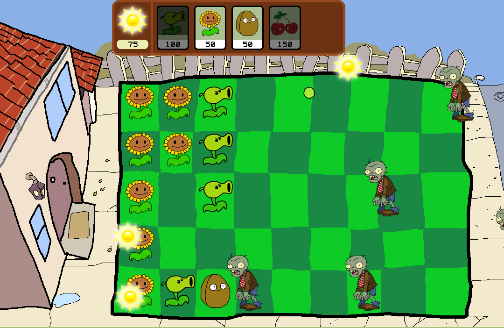

# 🌻🧟‍ Plants vs Zombies paint edition

A simplified, modular clone of *Plants vs Zombies* with *paint* graphics, written in Python.

## 🛠 Requirements

- Python 3.10+
- `pygame`
- `pillow`

## 📸🧠 Screenshot


## 📦 Installation
From the project root:
```bash
pip install .
```

## 🚀 Run the Game
```bash
python -m pvz
```